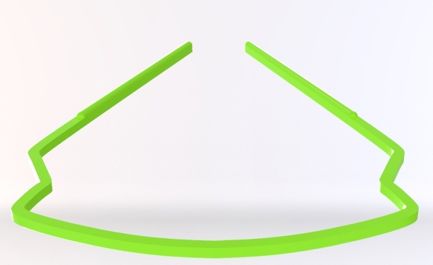
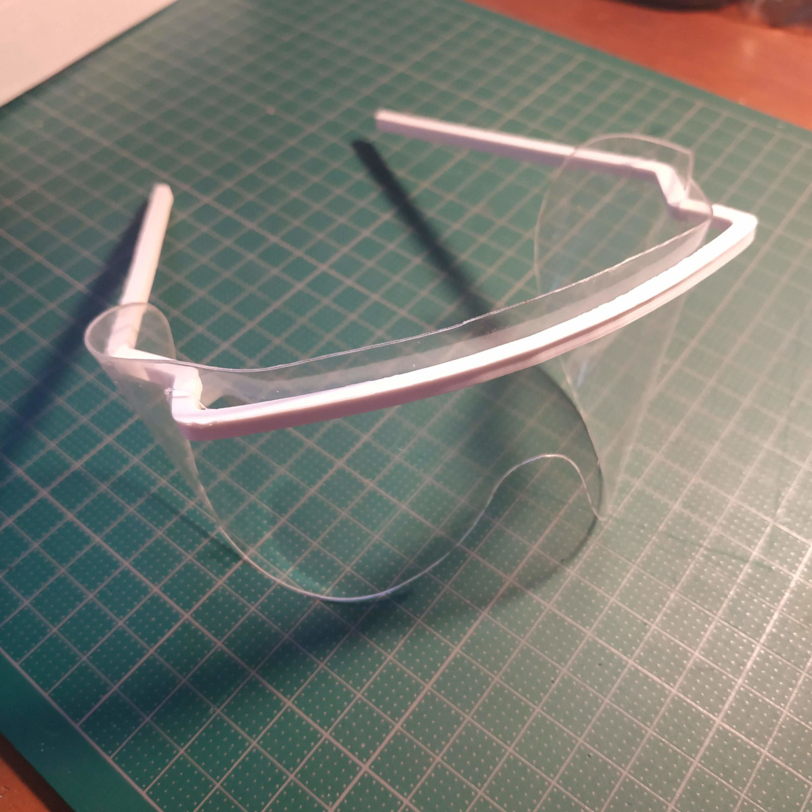

# Coronalab

Dépot de différents projets réalisés durant la pandémie du covid19.

# Lunette de protection CHUV
 
Réalisée sur la base des cotes réelles de celle utilisée (voir fichiers frame_scan.pdf et glasses_scan.pdf)

- Monture - 
	- fichier stl (unité: mm): glasses_frame.stl
	- code source du dessin réalisé avec Alibre Design: glasses_frame.AD_PRT
	- fichier stl test (modélisation OpenSCAD): glasses_frame_test.stl

- Visière -
	- fichier svg (unité: mm): glasses_lenses.svg
	- fichier dxf (unité: mm): glasses_lenses.dxf

Cette visière doit être découpée dans une feuille transparente de 0.20 mm d'épaisseur.

Nous cherchons la meilleure matière disponible pour cette réalisation (PETG ou Acrylique)
	

# Visière faciale

Nous pensions découper la visiere conçue par Konrad Klepacki et Mateusz Dyrda.
https://hackaday.io/project/170481-laser-cut-medical-shield

- Nous n'avons pas testé
	- VF/Assembly Instruction.pdf
	- VF/medical_shield_petg_05mm_SingleSheet.pdf
	

