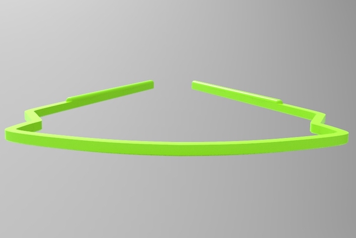
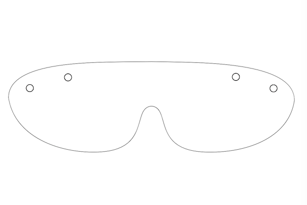
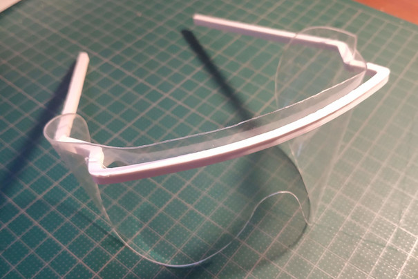

# Coronalab

**Dépot de différents projets réalisés durant la pandémie du covid19.**

## Lunettes de protection | _Protective glasses_

Lunettes de protection utilisées en milieu hospitalier. Modèle réalisé à la demande des hôpitaux universitaires afin d'assurer la continuité de l'aprovisionnement avec l'aide des fablab, makerspace et de toutes celles et ceux en mesure de contribuer avec leur équipement, leur temps et leur bonne volonté.

Le modèle est composé d'une **monture** à imprimer en 3D (FDM) ainsi que d'une **visière** découpée dans un film en polyester d'une épaisseur comprise entre 0.130 et 0.200 mm.

*+*
*=*

Après une phase initiale de récolte d'informations, de prototypage et de test ([lire l'historique](historique.md)), il est temps de passer à la **production**!

## Pourquoi participer ?

Ces lunettes répondent à une demande précise et donc à un besoin avéré des responsables du CHUV (Lausanne-Vaud) et des HUG (Genève), confrontés à la menace d'une pénurie puisque en ce moment l'approvisionnement par les canaux habituels est fortement perturbé voire impossible.
Elles sont utilisées par presque tous les services, au delà de ceux qui sont directement confrontés aux cas avérés de COVID-19. La situation actuelle menace d'aboutir à une pénurie qui affecterait l'ensemble des services.

## Comment participer ?

Les besoins évoluent sans cesse, mais actuellement ils sont chiffrés à 700 montures et 4500 visières **par semaine**.
Pour la découpe des **visières** nous essayons en priorité d'avoir recours à de l'**équipement industriel** (découpeuses à lames), capable de produire plus aisément dans les volumes requis. En fonction de l'évolution des besoins, difficile à anticiper, une mise à contribution des découpeuses laser de nos labs et spaces pourrait être envisageable. Les fichiers pour la découpe sont disponibles en [svg](glasses/glasses_lenses.svg) et [dxf](glasses/glasses_lenses.dxf) (unité: mm)

Pour les montures, en revanche, tous les FabLab, Makerspace, tiers-lieux et individus disposant d'une **imprimante 3D FDM peuvent aider à éviter la pénurie dès maintenant**!

### Imprimer en 3D des **montures**

Annoncez-vous ici TODO:[liens vers le WIKI? email?]

Assurez-vous de remplir les [quelques critères de base: suivi de consignes d'hygiène - à discuter avec CHUV ; est-ce qu'ils vont de toute façon systematiquement désinfecter avant usage?] et prenez connaissance de la [logistique (préparation dans des sachets ou envelopes, envoi où? etiquetage avec qui et date?], ensuite:

| 👉 | Si votre matériau et votre machine son déjà dans la liste des [fichiers avec profile prêts à l'emploi](https://github.com/FabLabRenens/Coronalab/wiki/Print-profiles) vous pouvez commencer tout des suite |
| ---- | :---- |

| 👉 | Sinon, téléchargez le modèle [glasses_frame.stl](glasses/glasses_frame.stl) (unité: mm). TODO:  paramètres d'impression (matériaux, hauteur de couche, diamètre de buse, remplissage)] |
| ---- | :---- |

Les fichiers suivants sont également disponibles:

- code source du dessin, Alibre Design ou Atom3D: [glasses_frame.AD_PRT](glasses/glasses_frame.AD_PRT), et dessin 2D y relatif [glasses_frame.AD_DRW](glasses/glasses_frame.AD_DRW). Penses au fait que toute modification du modèle demande en principe une validation par les hôpitaux avant d'être produite en masse...

- profil 2D: [dxf 14](glasses/glasses_frame.dxf) et [svg](glasses/glasses_frame.svg) (en cas de doutes sur l'échelle/les unités utilisées: largeur totale de l'objet réel 121.4 mm)
- dessin au format STEP AP 242: [glasses_frame_step_ap_242.stp](glasses/glasses_frame_step_ap_242.stp)
- stl issu de tests de modélisation OpenSCAD - *utiliser uniquement pour des test, PAS pour la production*): [glasses_frame_test.stl](glasses/glasses_frame_test.stl)

## Visières faciales intégrales

Nous pensions découper la visiere conçue par Konrad Klepacki et Mateusz Dyrda.
https://hackaday.io/project/170481-laser-cut-medical-shield
Cette visière présente l'avantage d'être produite uniquement par découpage de feuilles de PETG de 0.5 mm d'épaisseur.

- Nous ne l'avons pas testée : les fichiers sont dans le répertoire VF

Nous pouvons utiliser le même film de 130 ou 180 microns employé pour les lunettes avec ce modéle de structure :
https://www.myminifactory.com/fr/object/3d-print-115247?fbclid=IwAR2c9N3aFWIlBcmv_PWLbtqA287igzUk3-ZPRXvf5xEHGqIFypm60IjLfNA

- [newshieldsupport-org-notext.stl](ns/newshieldsupport-org-notext.stl)
	

